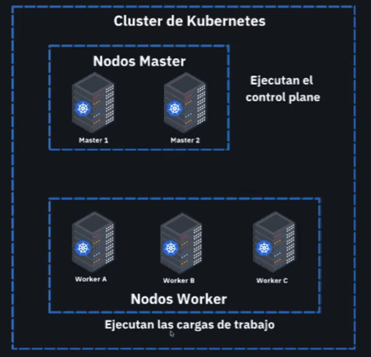
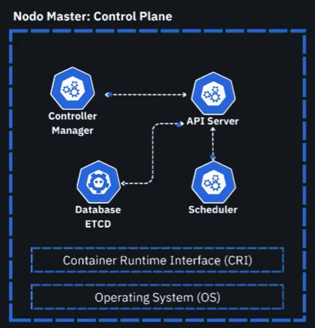
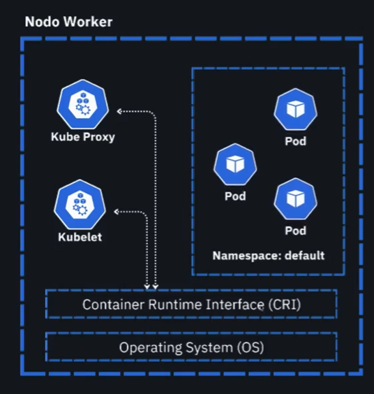
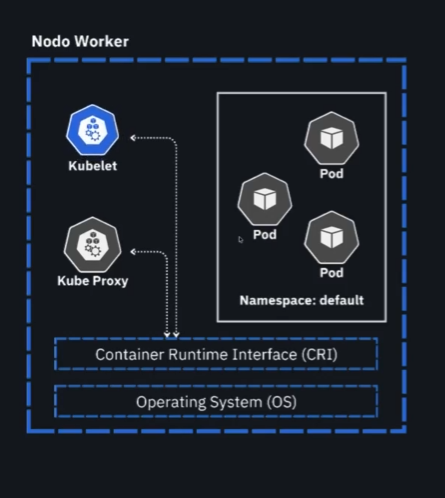
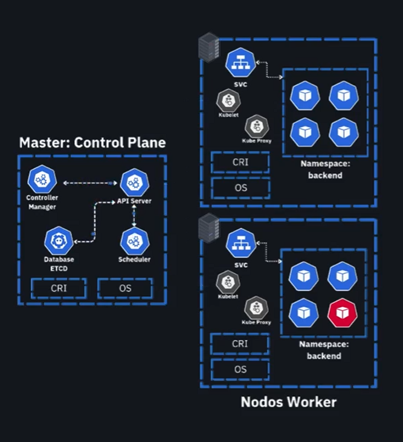

# Kubernetes

# Clase 1

## ¿Qué es Kubernetes y por qué es esencial?
¿Has notado cómo plataformas populares como Netflix y Spotify gestionan eficientemente millones de usuarios sin interrupciones? Esto es posible gracias a Kubernetes, a menudo referido como "K ocho S". Kubernetes es una herramienta que garantiza que las aplicaciones en la nube funcionen de manera impecable, como una orquesta perfectamente sincronizada.

## ¿Cómo funciona Kubernetes?
Imagina que Kubernetes es el director de una orquesta, donde cada contenedor es un músico. En caso de que un músico cometiera un error o dejara de tocar, Kubernetes automáticamente lo sustituiría para que la música continuara sin interrupciones. Ahora, si la audiencia aumenta de repente, Kubernetes añade más músicos automáticamente, asegurando que la sinfonía no se vea afectada.

## ¿Por qué aprender Kubernetes?
Alta disponibilidad: Kubernetes garantiza que, si un contenedor falla, otro toma inmediatamente su lugar, asegurando la continuidad del servicio.
Escalabilidad automática: cuando el tráfico de una aplicación incrementa, Kubernetes añade más recursos automáticamente para gestionar la carga adicional.
Portabilidad: Kubernetes asegura que tu aplicación funcionará de la misma manera, ya sea en una computadora local o en la nube.
## ¿Qué aprenderás sobre Kubernetes?
Al embarcarte en este viaje de aprendizaje, descubrirás cómo montar tu propio clúster local utilizando herramientas como MiniKube. Aprenderás a manejar una arquitectura compleja de Kubernetes, entendiendo cómo cada parte de la "orquesta", como pods, deployments y réplicas, trabaja en conjunto. Además, se profundizará en el despliegue de aplicaciones que no solo sean escalables, sino también tolerantes a errores, garantizando así que la "música" nunca se detenga, incluso frente a fallos.

## Configuración de un clúster local
Configurar un clúster local es similar a montar una orquesta desde cero en tu computadora. MiniKube es una herramienta clave en este proceso:

```sh
minikube start
```

Este comando lanza un clúster local básico en tu máquina, proporcionando el entorno necesario para ejecutar Kubernetes de manera local.

## Resolución de problemas y optimización
Una parte crucial del aprendizaje con Kubernetes es aprender a solucionar problemas como un verdadero director de orquesta. Estarás equipado para identificar y resolver problemas de manera eficiente, manteniendo la armonía y continuidad de tus aplicaciones.

A medida que te adentres en el universo de Kubernetes, descubrirás que no es solo una herramienta. Es el director que transforma la gestión de la infraestructura en una sinfonía perfecta. Este curso es tu oportunidad para nutrir tus habilidades en infraestructura, desarrollo y la nube y elevarlas a un nivel profesional sólido y avanzado. ¡Únete y comienza a convertirte en un maestro orquestador del mundo tecnológico!

## ¿Qué Kubernetes es y por qué es importante?

un sistema de orquestacion

si un musico deja de tocar, el sistema se encarga de reemplazarlo o agregar mas musicos para que la orquesta siga tocando con la nueva alta demanda.

### ¿Por qué aprender Kubernetes?
Alta disponibilidad: Kubernetes garantiza que, si un contenedor falla, otro toma inmediatamente su lugar, asegurando la continuidad del servicio.
Escalabilidad automática: cuando el tráfico de una aplicación incrementa, Kubernetes añade más recursos automáticamente para gestionar la carga adicional.
Portabilidad: Kubernetes asegura que tu aplicación funcionará de la misma manera, ya sea en una computadora local o en la nube.

### Configuración de un clúster local
Configurar un clúster local es similar a montar una orquesta desde cero en tu computadora. MiniKube es una herramienta clave en este proceso:

minikube start
- pods
- deployments
- replica set


# Clase 2
## Configurar un clúster local con Minikube

### Instalar

https://kubernetes.io/docs/tasks/tools/

https://minikube.sigs.k8s.io/docs/start/?arch=%2Flinux%2Fx86-64%2Fstable%2Fdebian+package

- `kubectl`
- `minikube`

```sh
minikube start --driver=docker
```

```sh
docker ps
```

```sh
kubectl get nodes
```

```sh
kubectl get pods -A
```

```sh
minikube addons list

minikube addons enable registry

minikube addons enable metrics-server
```

### Contextos

```sh
kubectl config get-contexts
```

```sh
kubectl config use-context minikube
```


### Minikube

```sh
kubectl run hello-cloud --image=nginx
```

```sh
minikube dashboard
```

```sh
minikube start

minikube stop
```


# Clase 3

## ¿Cómo configurar un clúster local de Kubernetes con MiniKube?
Kubernetes es una herramienta poderosa y compleja, pero no es necesario tener un clúster gigante para comenzar a trabajar con ella. Puedes configurar un clúster en tu máquina local utilizándolo de manera simple y efectiva. MiniKube es la solución ideal para testar y experimentar con Kubernetes sin mucha complicación, y en este artículo te mostraremos cómo hacerlo. Sigue leyendo para descubrir cómo instalar y configurar MiniKube y KubeCtl en pasos sencillos.

##  ¿Qué herramientas necesitas instalar?
Para trabajar con Kubernetes en un entorno local, se requieren dos herramientas esenciales:

KubeCtl: permite la comunicación con el clúster.
MiniKube: despliega una instancia de Docker para simular el entorno de Kubernetes.
## Instalación de KubeCtl
Para instalar KubeCtl en macOS usando HomeBrew, simplemente ejecuta:

`brew install kubectl`
Una vez instalado, puedes verificar su funcionamiento ejecutando:

```sh
kubectl version --client
kubectl --help
```
Esto te proporcionará una lista de comandos básicos a utilizar. No te preocupes si parece mucha información; a lo largo del aprendizaje te familiarizarás con estos comandos.

## Instalación de MiniKube
Similarmente, para instalar MiniKube usando HomeBrew:
```sh
brew install minikube
```
Con MiniKube, puedes ejecutar:
```sh
minikube --help
```
Este comando te mostrará varias opciones, como iniciar, detener clústers, y conectar diferentes plugins.

¿Cómo inicializar tu clúster con MiniKube?
Ya con las herramientas instaladas, el siguiente paso es inicializar el clúster. Esto lo logras ejecutando:

```sh
minikube start --driver=docker
```

Este comando utiliza Docker como driver por defecto, pero MiniKube te permite trabajar con otros hypervisors como HyperB o VirtualBox, dependiendo de tu sistema operativo.

¿Cómo aprovechar las funcionalidades de MiniKube?
MiniKube no solo facilita la creación de clústers, sino que también cuenta con utilidades adicionales:

Crear clústers multinodo.
Configurar un dashboard de manera sencilla.
Exponer servicios a través de tunelización.
Además, puedes listar los plugins disponibles con:

minikube addons list
Para mejorar aún más la funcionalidad, puedes habilitar ciertos complementos como el 'registry' y el 'Metric Server':

```sh
        minikube addons enable registry
        eval $(minikube docker-env)
        minikube addons enable metrics-server
```
¿Cómo interactuar con tu clúster local?
Una vez completada la configuración, puedes ejecutar comandos básicos para interactuar con tu clúster local. Por ejemplo, para ver los nodos:

```sh
kubectl get nodes
```
Para gestionar y visualizar las imágenes de Docker dentro de tu clúster, puedes ejecutar:
```sh
docker images
```
Para comprobar el contexto del clúster y cambiar entre diferentes contextos, utiliza:

```sh
kubectl config get-contexts
kubectl config use-context "nombre-contexto"
```
¿Cómo desplegar aplicaciones en Kubernetes?
Puedes desplegar aplicaciones en tu entorno de Kubernetes de forma rápida. Por ejemplo, para desplegar una imagen de prueba:

```sh
kubectl run hello-cloud --image=nginx
```
Luego, verifica el estado de tus pods con:

```sh
kubectl get pods
```
¿Cómo usar el dashboard de Kubernetes?
MiniKube te permite interactuar con Kubernetes a través de un dashboard web. Puedes acceder a él con el siguiente comando:

```sh
minikube dashboard
```
Esto abrirá una URL en tu navegador, donde podrás visualizar tus pods, deployments y más, ofreciendo una representación gráfica del funcionamiento interno de Kubernetes.

Es impresionante como herramientas como MiniKube y KubeCtl pueden simplificar el aprendizaje y experimentación de Kubernetes. No te detengas aquí; continúa explorando, practicando y desarrollando tus habilidades para estar preparado en ambientes de producción reales.

Kubernetes se compone principalmente de servidores y nodos con:

- Nodos Master: se recomienda tener mas de un nodo maestro para tener alta disponibilidad.

- Nodos Worker: son los encargados de ejecutar las aplicaciones y servicios en contenedores.



En local puedes trabajar con un solo servidor en la capa de los maestros.

En desarrollo trabajaremos con un solo nodo en local con Minikube.

### Nodos maestros



El api server es el punto de entrada de todas las peticiones al cluster.

permitiendo que nuestro cluster orqueste recursos y servicios.

Al examinar a fondo los nodos maestro, encontramos varios componentes esenciales que conforman el control plane:

- API Server: Es el punto de entrada para toda comunicación dentro del cluster. Cuando ejecutas un comando como kubectl get pods, este llega al API Server, que se comunica con otros componentes para proporcionar la respuesta adecuada.

- etcd: Esta base de datos llave-valor de alta concurrencia registra cada cambio realizado, asegurando que el cluster siempre mantenga actualizado su estado deseado. Funciona como la "memoria" persistente de Kubernetes.

- Controller Manager: No es un solo controlador, sino un conjunto de ellos que monitorean diferentes aspectos del cluster, verifica que el estado deseado vs el estado actual coincidan, organizando y levantando recursos según sea necesario:

  - **El Node Controller** verifica la salud de todos los nodos
  - **El Replication Controller** asegura que exista la cantidad correcta de pods
  - **El Endpoint Controller** gestiona la comunicación entre servicios

- **Scheduler**: Decide en qué nodo se ejecutará cada pod, basándose en los recursos requeridos (CPU, memoria, GPU) y los recursos disponibles en cada nodo worker.

#### Ejemplo de una orquesta musical:
Si el control plain es un directo de orquesta
Enviando y recibiendo las partipuras con el API Server, guardandolas en el estado deseado del cluster en una base de datos etcd.
Controller Manager es la tarea de estar validando que los musicos no es equivoquen y siempre esten presente
y el Scheduler seria durante el concierto cuando indica que seccion musical debe tocar.

### Nodos Worker



Los nodos worker contienen componentes igualmente importantes:

- **Kubelet**: Este agente se ejecuta en cada nodo worker y se comunica con el API Server para garantizar que los contenedores funcionen correctamente. Si detecta errores, informa para que se tomen acciones correctivas.

- **kube-proxy**: Gestiona la capa de red del cluster, facilitando la comunicación entre pods y con el exterior.

- **Container Runtime Interface (CRI)**: Es el encargado de ejecutar los contenedores dentro del nodo. Aunque anteriormente se utilizaba Docker por defecto, las versiones más recientes de Kubernetes han migrado a containerd. (Anteriormente era Docker), con esta se comunica con todos los contenedores en ejecución.
K8s no corre contenedores directamente, sino que utiliza el CRI para gestionarlos.



Los namespaces son la separación lógica de recursos dentro del cluster. Y dentro de cada uno vive nuestro pod, nuestra unidad fundamental dentro de k8s.


## ¿Cómo se organizan las cargas de trabajo en Kubernetes?
Kubernetes utiliza conceptos importantes para organizar y gestionar las cargas de trabajo de manera eficiente:

## ¿Qué son los namespaces y cuál es su función?
Los namespaces proporcionan una separación lógica de recursos dentro del cluster. Esta organización depende del caso de uso específico de cada empresa:

- Algunos equipos definen namespaces por tipo de aplicación (frontend/backend)
- Otros prefieren organizar por equipos funcionales (pagos, interfaz de usuario, API)
- Lo importante es que Kubernetes se adapta a cualquier caso de uso sin inconvenientes
Dentro de estos namespaces viven los pods, que son la unidad fundamental de Kubernetes. Un pod puede contener uno o múltiples contenedores, dependiendo de las necesidades específicas.

## ¿Cómo gestionan los services la comunicación en Kubernetes?

Los services usan kube-proxy dentro de los nodos worker para gestionar la comunicación entre pods y con el exterior.

Los services son componentes que aceptan tráfico y lo redirigen a grupos específicos de pods. Existen diferentes tipos:

- **NodePort**: Utilizado principalmente en entornos de desarrollo, expone un puerto específico en cada nodo worker para permitir comunicación externa hacia los pods. No se recomienda para entornos productivos. **Nos permite abrir trafico del exterior hacia los pods de un cluster para casos de prueba, no es recomendado en entornos productivos.**

- **ClusterIP**: Permite comunicación interna dentro del cluster mediante una IP específica. Facilita el balanceo de carga entre pods asociados a una misma aplicación. Garantiza mejor conexion hacia cada uno de nuestros pods.

- **LoadBalancer**: Al trabajar con Kubernetes en la nube, este tipo de servicio crea automáticamente un balanceador de carga en el proveedor de servicios cloud, garantizando un tráfico más escalable y resiliente. Crea un loadbalancer dentro de nuestro cloud provider (AWS, GCP, Azure) para distribuir el trafico entre los nodos worker. Para permitirnos un mejor trafico entre los componentes.

- **ExternalName**: **Altamente recomendado para entornos productivos**, permite mapear un nombre público (como una base de datos RDS en AWS) a un nombre privado dentro del cluster. Optimiza los tiempos de comunicación entre servicios internos y externos.


## ¿Cómo funciona el flujo de una aplicación en Kubernetes?
El despliegue de una aplicación en Kubernetes sigue un proceso bien definido:



1. Se despliega un pod dentro de un namespace específico, determinas la cantidad de pods que viviran dentro de una aplicacion.
2. El scheduler determina en qué nodo worker colocarlo
3. El kubelet en ese nodo arranca el contenedor correspondiente
4. El kube-proxy establece la capa de red para permitir comunicaciones
5. Los servicios (como un Ingress o un balanceador de carga) redirigen las peticiones HTTP desde Internet hacia los pods correctos

Este proceso completo permite que Kubernetes actúe como un verdadero director de orquesta, coordinando todos los elementos para que nuestra aplicación funcione de manera óptima, escalable y resistente a fallos.

La arquitectura de Kubernetes representa una solución elegante para los desafíos de la computación moderna, permitiendo despliegues resilientes y escalables sin importar la complejidad de la aplicación. ¿Has implementado Kubernetes en tu organización? ¿Qué otros aspectos de su arquitectura te gustaría explorar? Comparte tu experiencia en los comentarios.

# Clase 4

## ¿Cómo configurar y empezar a trabajar con Kubernetes usando MiniKube?

Conocer cómo configurar y gestionar Kubernetes eficientemente es fundamental para cualquier profesional en el área de DevOps o administración de sistemas. Con un clúster configurado con MiniKube, podemos comenzar a explorar las capacidades de Kubernetes. A continuación, te ofrecemos una guía paso a paso basada en prácticas recomendadas para que puedas aprovechar al máximo las herramientas a tu disposición.