# Kubernetes

# Clase 1

## ¿Qué es Kubernetes y por qué es esencial?
¿Has notado cómo plataformas populares como Netflix y Spotify gestionan eficientemente millones de usuarios sin interrupciones? Esto es posible gracias a Kubernetes, a menudo referido como "K ocho S". Kubernetes es una herramienta que garantiza que las aplicaciones en la nube funcionen de manera impecable, como una orquesta perfectamente sincronizada.

## ¿Cómo funciona Kubernetes?
Imagina que Kubernetes es el director de una orquesta, donde cada contenedor es un músico. En caso de que un músico cometiera un error o dejara de tocar, Kubernetes automáticamente lo sustituiría para que la música continuara sin interrupciones. Ahora, si la audiencia aumenta de repente, Kubernetes añade más músicos automáticamente, asegurando que la sinfonía no se vea afectada.

## ¿Por qué aprender Kubernetes?
Alta disponibilidad: Kubernetes garantiza que, si un contenedor falla, otro toma inmediatamente su lugar, asegurando la continuidad del servicio.
Escalabilidad automática: cuando el tráfico de una aplicación incrementa, Kubernetes añade más recursos automáticamente para gestionar la carga adicional.
Portabilidad: Kubernetes asegura que tu aplicación funcionará de la misma manera, ya sea en una computadora local o en la nube.
## ¿Qué aprenderás sobre Kubernetes?
Al embarcarte en este viaje de aprendizaje, descubrirás cómo montar tu propio clúster local utilizando herramientas como MiniKube. Aprenderás a manejar una arquitectura compleja de Kubernetes, entendiendo cómo cada parte de la "orquesta", como pods, deployments y réplicas, trabaja en conjunto. Además, se profundizará en el despliegue de aplicaciones que no solo sean escalables, sino también tolerantes a errores, garantizando así que la "música" nunca se detenga, incluso frente a fallos.

## Configuración de un clúster local
Configurar un clúster local es similar a montar una orquesta desde cero en tu computadora. MiniKube es una herramienta clave en este proceso:

```sh
minikube start
```

Este comando lanza un clúster local básico en tu máquina, proporcionando el entorno necesario para ejecutar Kubernetes de manera local.

## Resolución de problemas y optimización
Una parte crucial del aprendizaje con Kubernetes es aprender a solucionar problemas como un verdadero director de orquesta. Estarás equipado para identificar y resolver problemas de manera eficiente, manteniendo la armonía y continuidad de tus aplicaciones.

A medida que te adentres en el universo de Kubernetes, descubrirás que no es solo una herramienta. Es el director que transforma la gestión de la infraestructura en una sinfonía perfecta. Este curso es tu oportunidad para nutrir tus habilidades en infraestructura, desarrollo y la nube y elevarlas a un nivel profesional sólido y avanzado. ¡Únete y comienza a convertirte en un maestro orquestador del mundo tecnológico!

## ¿Qué Kubernetes es y por qué es importante?

un sistema de orquestacion

si un musico deja de tocar, el sistema se encarga de reemplazarlo o agregar mas musicos para que la orquesta siga tocando con la nueva alta demanda.

### ¿Por qué aprender Kubernetes?
Alta disponibilidad: Kubernetes garantiza que, si un contenedor falla, otro toma inmediatamente su lugar, asegurando la continuidad del servicio.
Escalabilidad automática: cuando el tráfico de una aplicación incrementa, Kubernetes añade más recursos automáticamente para gestionar la carga adicional.
Portabilidad: Kubernetes asegura que tu aplicación funcionará de la misma manera, ya sea en una computadora local o en la nube.

### Configuración de un clúster local
Configurar un clúster local es similar a montar una orquesta desde cero en tu computadora. MiniKube es una herramienta clave en este proceso:

minikube start
- pods
- deployments
- replica set


# Clase 2
## Configurar un clúster local con Minikube

### Instalar

https://kubernetes.io/docs/tasks/tools/

https://minikube.sigs.k8s.io/docs/start/?arch=%2Flinux%2Fx86-64%2Fstable%2Fdebian+package

- `kubectl`
- `minikube`

```sh
minikube start --driver=docker
```

```sh
docker ps
```

```sh
kubectl get nodes
```

```sh
kubectl get pods -A
```

```sh
minikube addons list

minikube addons enable registry

minikube addons enable metrics-server
```

### Contextos

Cuales son mis contextos disponibles?

```sh
kubectl config get-contexts
```

Cambiar de contexto a minikube

```sh
kubectl config use-context minikube
```

Cual es mi contexto actual?

```sh
kubectl config current-context
```

Cuales son los clusters disponibles?

```sh
kubectl config get-clusters
```


### Minikube

```sh
kubectl run hello-cloud --image=nginx
```

```sh
minikube dashboard
```

```sh
minikube start

minikube stop
```


# Clase 3

## ¿Cómo configurar un clúster local de Kubernetes con MiniKube?
Kubernetes es una herramienta poderosa y compleja, pero no es necesario tener un clúster gigante para comenzar a trabajar con ella. Puedes configurar un clúster en tu máquina local utilizándolo de manera simple y efectiva. MiniKube es la solución ideal para testar y experimentar con Kubernetes sin mucha complicación, y en este artículo te mostraremos cómo hacerlo. Sigue leyendo para descubrir cómo instalar y configurar MiniKube y KubeCtl en pasos sencillos.

##  ¿Qué herramientas necesitas instalar?
Para trabajar con Kubernetes en un entorno local, se requieren dos herramientas esenciales:

KubeCtl: permite la comunicación con el clúster.
MiniKube: despliega una instancia de Docker para simular el entorno de Kubernetes.
## Instalación de KubeCtl
Para instalar KubeCtl en macOS usando HomeBrew, simplemente ejecuta:

`brew install kubectl`
Una vez instalado, puedes verificar su funcionamiento ejecutando:

```sh
kubectl version --client
kubectl --help
```
Esto te proporcionará una lista de comandos básicos a utilizar. No te preocupes si parece mucha información; a lo largo del aprendizaje te familiarizarás con estos comandos.

## Instalación de MiniKube
Similarmente, para instalar MiniKube usando HomeBrew:
```sh
brew install minikube
```
Con MiniKube, puedes ejecutar:
```sh
minikube --help
```
Este comando te mostrará varias opciones, como iniciar, detener clústers, y conectar diferentes plugins.

¿Cómo inicializar tu clúster con MiniKube?
Ya con las herramientas instaladas, el siguiente paso es inicializar el clúster. Esto lo logras ejecutando:

```sh
minikube start --driver=docker
```

Este comando utiliza Docker como driver por defecto, pero MiniKube te permite trabajar con otros hypervisors como HyperB o VirtualBox, dependiendo de tu sistema operativo.

¿Cómo aprovechar las funcionalidades de MiniKube?
MiniKube no solo facilita la creación de clústers, sino que también cuenta con utilidades adicionales:

Crear clústers multinodo.
Configurar un dashboard de manera sencilla.
Exponer servicios a través de tunelización.
Además, puedes listar los plugins disponibles con:

minikube addons list
Para mejorar aún más la funcionalidad, puedes habilitar ciertos complementos como el 'registry' y el 'Metric Server':

```sh
        minikube addons enable registry
        eval $(minikube docker-env)
        minikube addons enable metrics-server
```
¿Cómo interactuar con tu clúster local?
Una vez completada la configuración, puedes ejecutar comandos básicos para interactuar con tu clúster local. Por ejemplo, para ver los nodos:

```sh
kubectl get nodes
```
Para gestionar y visualizar las imágenes de Docker dentro de tu clúster, puedes ejecutar:
```sh
docker images
```
Para comprobar el contexto del clúster y cambiar entre diferentes contextos, utiliza:

```sh
kubectl config get-contexts
kubectl config use-context "nombre-contexto"
```
¿Cómo desplegar aplicaciones en Kubernetes?
Puedes desplegar aplicaciones en tu entorno de Kubernetes de forma rápida. Por ejemplo, para desplegar una imagen de prueba:

```sh
kubectl run hello-cloud --image=nginx
```
Luego, verifica el estado de tus pods con:

```sh
kubectl get pods
```
¿Cómo usar el dashboard de Kubernetes?
MiniKube te permite interactuar con Kubernetes a través de un dashboard web. Puedes acceder a él con el siguiente comando:

```sh
minikube dashboard
```
Esto abrirá una URL en tu navegador, donde podrás visualizar tus pods, deployments y más, ofreciendo una representación gráfica del funcionamiento interno de Kubernetes.

Es impresionante como herramientas como MiniKube y KubeCtl pueden simplificar el aprendizaje y experimentación de Kubernetes. No te detengas aquí; continúa explorando, practicando y desarrollando tus habilidades para estar preparado en ambientes de producción reales.

Kubernetes se compone principalmente de servidores y nodos con:

- Nodos Master: se recomienda tener mas de un nodo maestro para tener alta disponibilidad.

- Nodos Worker: son los encargados de ejecutar las aplicaciones y servicios en contenedores.

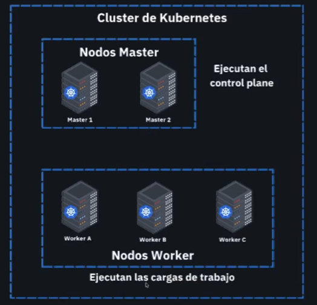

En local puedes trabajar con un solo servidor en la capa de los maestros.

En desarrollo trabajaremos con un solo nodo en local con Minikube.

### Nodos maestros

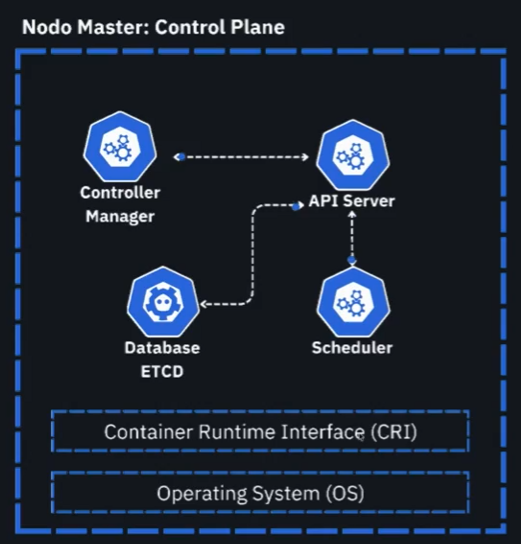

El api server es el punto de entrada de todas las peticiones al cluster.

permitiendo que nuestro cluster orqueste recursos y servicios.

Al examinar a fondo los nodos maestro, encontramos varios componentes esenciales que conforman el control plane:

- API Server: Es el punto de entrada para toda comunicación dentro del cluster. Cuando ejecutas un comando como kubectl get pods, este llega al API Server, que se comunica con otros componentes para proporcionar la respuesta adecuada.

- etcd: Esta base de datos llave-valor de alta concurrencia registra cada cambio realizado, asegurando que el cluster siempre mantenga actualizado su estado deseado. Funciona como la "memoria" persistente de Kubernetes.

- Controller Manager: No es un solo controlador, sino un conjunto de ellos que monitorean diferentes aspectos del cluster, verifica que el estado deseado vs el estado actual coincidan, organizando y levantando recursos según sea necesario:

  - **El Node Controller** verifica la salud de todos los nodos
  - **El Replication Controller** asegura que exista la cantidad correcta de pods
  - **El Endpoint Controller** gestiona la comunicación entre servicios

- **Scheduler**: Decide en qué nodo se ejecutará cada pod, basándose en los recursos requeridos (CPU, memoria, GPU) y los recursos disponibles en cada nodo worker.

#### Ejemplo de una orquesta musical:
Si el control plain es un directo de orquesta
Enviando y recibiendo las partipuras con el API Server, guardandolas en el estado deseado del cluster en una base de datos etcd.
Controller Manager es la tarea de estar validando que los musicos no es equivoquen y siempre esten presente
y el Scheduler seria durante el concierto cuando indica que seccion musical debe tocar.

### Nodos Worker

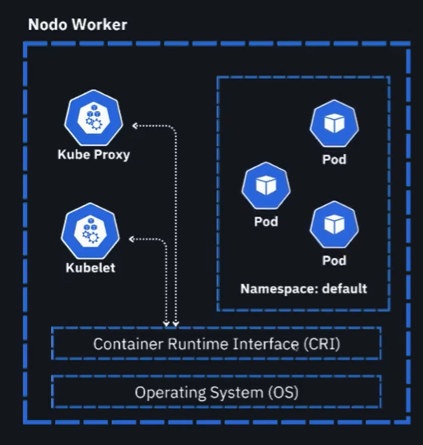

Los nodos worker contienen componentes igualmente importantes:

- **Kubelet**: Este agente se ejecuta en cada nodo worker y se comunica con el API Server para garantizar que los contenedores funcionen correctamente. Si detecta errores, informa para que se tomen acciones correctivas.

- **kube-proxy**: Gestiona la capa de red del cluster, facilitando la comunicación entre pods y con el exterior.

- **Container Runtime Interface (CRI)**: Es el encargado de ejecutar los contenedores dentro del nodo. Aunque anteriormente se utilizaba Docker por defecto, las versiones más recientes de Kubernetes han migrado a containerd. (Anteriormente era Docker), con esta se comunica con todos los contenedores en ejecución.
K8s no corre contenedores directamente, sino que utiliza el CRI para gestionarlos.

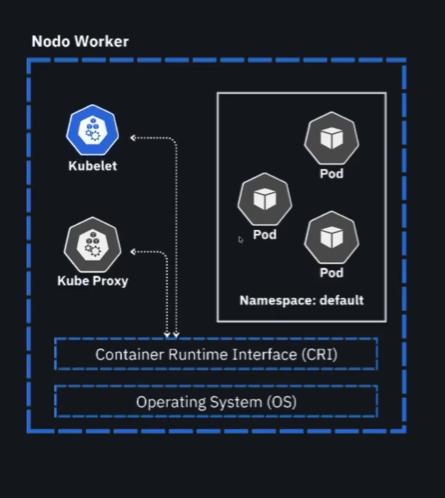

Los namespaces son la separación lógica de recursos dentro del cluster. Y dentro de cada uno vive nuestro pod, nuestra unidad fundamental dentro de k8s.


## ¿Cómo se organizan las cargas de trabajo en Kubernetes?
Kubernetes utiliza conceptos importantes para organizar y gestionar las cargas de trabajo de manera eficiente:

## ¿Qué son los namespaces y cuál es su función?
Los namespaces proporcionan una separación lógica de recursos dentro del cluster. Esta organización depende del caso de uso específico de cada empresa:

- Algunos equipos definen namespaces por tipo de aplicación (frontend/backend)
- Otros prefieren organizar por equipos funcionales (pagos, interfaz de usuario, API)
- Lo importante es que Kubernetes se adapta a cualquier caso de uso sin inconvenientes
Dentro de estos namespaces viven los pods, que son la unidad fundamental de Kubernetes. Un pod puede contener uno o múltiples contenedores, dependiendo de las necesidades específicas.

## ¿Cómo gestionan los services la comunicación en Kubernetes?

Los services usan kube-proxy dentro de los nodos worker para gestionar la comunicación entre pods y con el exterior.

Los services son componentes que aceptan tráfico y lo redirigen a grupos específicos de pods. Existen diferentes tipos:

- **NodePort**: Utilizado principalmente en entornos de desarrollo, expone un puerto específico en cada nodo worker para permitir comunicación externa hacia los pods. No se recomienda para entornos productivos. **Nos permite abrir trafico del exterior hacia los pods de un cluster para casos de prueba, no es recomendado en entornos productivos.**

- **ClusterIP**: Permite comunicación interna dentro del cluster mediante una IP específica. Facilita el balanceo de carga entre pods asociados a una misma aplicación. Garantiza mejor conexion hacia cada uno de nuestros pods.

- **LoadBalancer**: Al trabajar con Kubernetes en la nube, este tipo de servicio crea automáticamente un balanceador de carga en el proveedor de servicios cloud, garantizando un tráfico más escalable y resiliente. Crea un loadbalancer dentro de nuestro cloud provider (AWS, GCP, Azure) para distribuir el trafico entre los nodos worker. Para permitirnos un mejor trafico entre los componentes.

- **ExternalName**: **Altamente recomendado para entornos productivos**, permite mapear un nombre público (como una base de datos RDS en AWS) a un nombre privado dentro del cluster. Optimiza los tiempos de comunicación entre servicios internos y externos.


## ¿Cómo funciona el flujo de una aplicación en Kubernetes?
El despliegue de una aplicación en Kubernetes sigue un proceso bien definido:

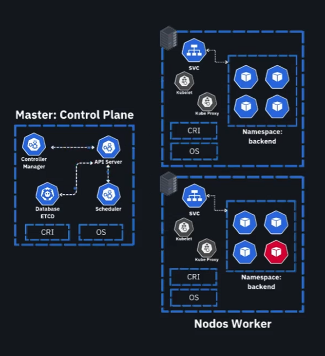

1. Se despliega un pod dentro de un namespace específico, determinas la cantidad de pods que viviran dentro de una aplicacion.
2. El scheduler determina en qué nodo worker colocarlo
3. El kubelet en ese nodo arranca el contenedor correspondiente
4. El kube-proxy establece la capa de red para permitir comunicaciones
5. Los servicios (como un Ingress o un balanceador de carga) redirigen las peticiones HTTP desde Internet hacia los pods correctos

Este proceso completo permite que Kubernetes actúe como un verdadero director de orquesta, coordinando todos los elementos para que nuestra aplicación funcione de manera óptima, escalable y resistente a fallos.

La arquitectura de Kubernetes representa una solución elegante para los desafíos de la computación moderna, permitiendo despliegues resilientes y escalables sin importar la complejidad de la aplicación. ¿Has implementado Kubernetes en tu organización? ¿Qué otros aspectos de su arquitectura te gustaría explorar? Comparte tu experiencia en los comentarios.

# Clase 4 Introducción a la API de Kubernetes y Kubectl

## ¿Cómo configurar y empezar a trabajar con Kubernetes usando MiniKube?
Conocer cómo configurar y gestionar Kubernetes eficientemente es fundamental para cualquier profesional en el área de DevOps o administración de sistemas. Con un clúster configurado con MiniKube, podemos comenzar a explorar las capacidades de Kubernetes. A continuación, te ofrecemos una guía paso a paso basada en prácticas recomendadas para que puedas aprovechar al máximo las herramientas a tu disposición.

## ¿Cuál es el primer paso para iniciar con MiniKube y Kubernetes?
Primero, se debe tener el clúster local configurado con MiniKube. Este es una herramienta esencial que te permite gestionar tu clúster localmente, ofreciendo una plataforma flexible para diferentes configuraciones, como trabajar con múltiples nodos o diferentes versiones de Kubernetes. Para iniciar el clúster, usamos el comando:

```sh
minikube start --driver=docker
```

Este comando, además de levantar el clúster, puede ser complementado con varios parámetros específicos según tus necesidades, como el driver que prefieras usar.

Para ver los distintos perfiles de MiniKube que tienes configurados, puedes ejecutar:

```sh
minikube profile list
```

Los perfiles te permiten trabajar en diversas versiones de k8s o docker dependiendo de tus requerimientos.


## ¿Qué es KubeCTL y cómo interactuamos con Kubernetes?

```sh
kubectl get --help
```

KubeCTL es el puente esencial hacia el API server de tu clúster de Kubernetes. A través de este, podemos efectuar una variedad de solicitudes como crear, leer, actualizar y eliminar (CRUD) recursos. Un ejemplo básico para consultar los recursos es el comando:

```sh
kubectl get pods
```

Con este, podemos listar los pods activos en nuestro namespace actual. Sin embargo, para obtener más detalles, podemos usar:

```sh
kubectl get pods -o wide
```

Para buscar los pods a lo largo de todos los namespaces, utilizamos:

```sh
kubectl get pods -A
```

y verlos con detalles:

```sh
kubectl get pods -o wide -A
```

## ¿Qué son los namespaces y cómo gestionarlos?
Los namespaces son cruciales para organizar y separar lógicamente los recursos dentro de Kubernetes. Por defecto, el clúster tiene un namespace de "default", pero puedes crear y eliminar adicionales según sea necesario:

- Crear un nuevo namespace:

```sh
kubectl create namespace k8s-demo
```

```sh
kubectl create ns k8s-demo
```

- Validar la creación del namespace:

```sh
kubectl get namespaces
```

```sh
kubectl get ns
```

- Eliminar un namespace:

```sh
kubectl delete namespace k8s-demo
```

```sh
kubectl delete ns k8s-demo
```


## ¿Cómo gestionamos nodos dentro de Kubernetes?
Un aspecto importante de Kubernetes es la gestión de nodos que conforman el clúster, donde ejecutamos operaciones con:

- Listar nodos:

```sh
kubectl get nodes
```

- Describir un nodo:

```sh
kubectl describe node ${NOMBRE_DEL_NODO}
```

Estos comandos ofrecen información valiosa sobre el rol, estado y recursos del nodo.

## ¿Cómo se aplican configuraciones operadores declarativas e imperativas?

Kubernetes permite dos estilos para gestionar configuraciones:

Declarativa: utiliza archivos YAML para definir el estado deseado del sistema.
Imperativa: ejecuta comandos directamente para llevar a cabo una acción específica.
Para aplicar un pod usando un archivo YAML de manera imperativa, utilizamos:

```sh
kubectl apply -f simple-pod.yaml
```

Y para borrar ese pod si ya no es necesario:

```sh
kubectl delete pod
```

```sh
kubectl describe pods ${NOMBRE_DEL_POD}
```

```sh
kubectl delete pod lonely-pod
```


## ¿Cómo mantener nuestro clúster a punto con MiniKube?
Para personalizar nuestro clúster y expandir sus funcionalidades, MiniKube ofrece varios add-ons. Algunos esenciales para mejorar la gestión son:

```sh
minikube addons list
```


- Metric Server: para obtener métricas del clúster y posibilidades de autoescalamiento.

```sh
minikube addons enable metrics-server
```
- Registry: vincula el registro de Docker con MiniKube.

```sh
minikube addons enable registry
```

Estos componentes son críticos para un manejo eficiente y un desarrollo fluido dentro de Kubernetes.

Ahora que hemos explorado las bases para interactuar y gestionar Kubernetes con MiniKube y KubeCTL, es momento de aprender a desplegar aplicaciones complejas. ¡Sigue explorando y aprende más sobre el despliegue de aplicaciones frontend y backend con Kubernetes!

# Clase 5 Diferencias entre enfoques declarativos e imperativos

05-declarative-vs-imperative

## Imperative

## Create a pod imperatively
```bash
kubectl run mypod --image=nginx
```

## Get a pod imperatively
```bash
kubectl get pods
```

## Delete a pod imperatively
```bash
kubectl delete pod mypod
```

# Declarative

## Create a pod declaratively

```bash
kubectl apply -f mypod.yaml
```

`-f` flag is for file


## Delete a pod declaratively
```bash
kubectl delete -f mypod.yaml
```


## Liveness probe:

indica si el contenedor está vivo. Si falla, el contenedor se reinicia.

https://kubernetes.io/docs/tasks/configure-pod-container/configure-liveness-readiness-startup-probes/

# Clase 6 Pods, ReplicaSets y Deployments

```sh
kubectl get namespaces
```

```sh
kubectl get ns
```


Crear namespace

```sh
kubectl create ns pod-test
```


Crear un pod dentro del namespace pod-test
```sh
kubectl create pod -n pod-test
```

Borrar el namespace

```sh
kubectl delete ns pod-test
```


## Que es un pod?

Un Pod es la unidad más pequeña y básica de Kubernetes. Representa una instancia de una aplicación en ejecución en el clúster. Un Pod puede contener uno o más contenedores que comparten:

- Red: Todos los contenedores dentro de un Pod comparten la misma dirección IP y puerto.
- Almacenamiento: Los contenedores pueden compartir volúmenes montados.
- Ciclo de vida: Los contenedores dentro de un Pod se crean, ejecutan y eliminan juntos.

### Forma imperativa (CLI)

**Crear un pod de nginx**

```sh
kubectl run nginx-nodeport --image=nginx --restart=Never --port=80
```

```sh
kubectl describe pods nginx-nodeport
```

```sh
kubectl get svc
```

**Ver pods existentes**

```sh
kubectl get pods
```

**Exponer un servicio con port-forward**

```sh
kubectl port-forward pod/nginx-nodeport 8080:80
```

## Que significa Stateless vs statefull: tener o no tener estado, ahí está el dilema.

En Kubernetes, las aplicaciones pueden ser stateless (sin estado) o stateful (con estado). Esto afecta cómo se diseñan y gestionan los Pods.

#### Stateless (sin estado):
- No guardan datos persistentes entre reinicios.
- Ejemplo: Servidores web como Nginx o aplicaciones que procesan solicitudes HTTP.
- Escalabilidad sencilla: Puedes agregar o eliminar réplicas sin preocuparte por la consistencia de datos.

#### Stateful (con estado):
- Guardan datos persistentes y necesitan mantener el estado entre reinicios.
- Ejemplo: Bases de datos como MySQL o Redis.
- Requieren volúmenes persistentes (Persistent Volumes) para almacenar datos.

##  Diferencia entre replica set y deployment

[Kubernetes Deployment vs. ReplicaSet: Understanding the Differences](https://www.linkedin.com/pulse/kubernetes-deployment-vs-replicaset-understanding-differences-uw3ic/#:~:text=Use%20a%20ReplicaSet%20if%20you,recommended%20for%20most%20production%20workloads)

### Key Differences Between Deployment and ReplicaSet


| Feature | ReplicaSet | Deployment |
|---------|------------|------------|
| Ensures a fixed number of pods | ✅ Yes | ✅ Yes |
| Supports rolling updates | ❌ No | ✅ Yes |
| Allows rollback of changes | ❌ No | ✅ Yes |
| Manages multiple ReplicaSets for version control | ❌ No | ✅ Yes |
| Recommended for production workloads | ❌ No | ✅ Yes |


### When to Use Which?
Use a ReplicaSet if you need to ensure a fixed number of running pods but don’t require rolling updates.
Use a Deployment if you need rolling updates, automated scaling, and rollback capabilities (recommended for most production workloads).

###  Conclusion
While ReplicaSets are an essential Kubernetes primitive, they are rarely used directly. Deployments provide a higher-level abstraction that simplifies managing applications at scale. In almost all cases, using a Deployment instead of a standalone ReplicaSet is the best practice.


**En entornos productivos,** los pods sueles estar englobados dentro de un ReplicaSet, y los ReplicaSets a su vez son gestionados por un Deployment. Esto se debe a que el Deployment ofrece funcionalidades adicionales como actualizaciones sin tiempo de inactividad (rolling updates) y la capacidad de revertir cambios si algo sale mal.

## ReplicaSets: Garantizar la disponibilidad de Pods.

Los replicasets en kubernetes son responsables de mantener un número estable de réplicas de pods en ejecución en todo momento. Si un pod falla o se elimina, el replicaset automáticamente crea un nuevo pod para reemplazarlo, asegurando así la disponibilidad continua de la aplicación.

### Forma declarativa

**Crear un ReplicaSet**

```sh
kubectl apply -f replicaset.yaml
```

**Ver pods existentes**

```sh
kubectl get pods
```

**Ver ReplicaSet existentes**

```sh
kubectl get replicaset
```

**Eliminar un Pod**

```sh
kubectl delete pod nginx-replicaset-<pod-id>
```
Al eliminar un Pod, el ReplicaSet automáticamente crea un nuevo Pod para mantener el número deseado de réplicas (pods).


Eliminar replicaset

```sh
kubectl delete -f replicaset.yaml
```

## Deployments: Gestión declarativa de aplicaciones.

Un Deployment es una capa superior que gestiona ReplicaSets y proporciona una forma declarativa de implementar aplicaciones. Es la forma más común de gestionar aplicaciones en Kubernetes.


### Forma declarativa

**Crear un Deployment**

```sh
kubectl apply -f deployment.yaml
```

**Ver pods existentes**

```sh
kubectl get pods
```

**Ver Deployment existentes**

```sh
kubectl get deployment
```

Ver replicaset que creo el deployment

```sh
kubectl get replicaset
```

El beneficio de usar deployments es que nos facilita gestionar nuevas versiones de nuestra aplicacion. Y actualizar sin degradacion del servicio.

El deployment es el objeto mayor que orquesta a un replicaset.

**Describe el replicaset de un deployment**

```sh
kubectl describe replicaset ${replicaset-name}
```

Y mostrara la informacion del deployment que lo controla

```txt
Name:           hello-deployment-584f88f49b
Namespace:      default
Selector:       app=hello,pod-template-hash=584f88f49b
Labels:         app=hello
                pod-template-hash=584f88f49b
Annotations:    deployment.kubernetes.io/desired-replicas: 4
                deployment.kubernetes.io/max-replicas: 5
                deployment.kubernetes.io/revision: 1
Controlled By:  Deployment/hello-deployment
Replicas:       4 current / 4 desired
Pods Status:    4 Running / 0 Waiting / 0 Succeeded / 0 Failed
Pod Template:
  Labels:  app=hello
           pod-template-hash=584f88f49b
  Containers:
   hello-app:
    Image:         gcr.io/google-samples/hello-app:1.0
    Port:          8080/TCP
    Host Port:     0/TCP
    Environment:   <none>
    Mounts:        <none>
  Volumes:         <none>
  Node-Selectors:  <none>
  Tolerations:     <none>
Events:
  Type    Reason            Age   From                   Message
  ----    ------            ----  ----                   -------
  Normal  SuccessfulCreate  15m   replicaset-controller  Created pod: hello-deployment-584f88f49b-t9tkd
  Normal  SuccessfulCreate  15m   replicaset-controller  Created pod: hello-deployment-584f88f49b-swhzn
  Normal  SuccessfulCreate  15m   replicaset-controller  Created pod: hello-deployment-584f88f49b-7gm8l
  Normal  SuccessfulCreate  15m   replicaset-controller  Created pod: hello-deployment-584f88f49b-br6zw
```

**Eliminar un Pod**

```sh
kubectl delete pod hello-deployment-<pod-id>
```

**Actualizar la imagen del Deployment**

```sh
kubectl set image deployment/hello-deployment hello-app=gcr.io/google-samples/hello-app:2.0
```

**Verificar el progreso de la actualización** tras un cambio en el deployment, podemos verificar el estado del rollout para asegurarnos de que la actualización se está realizando correctamente:

```sh
kubectl rollout status deployment/hello-deployment
```

**Verificar los Pods actualizados**

```sh
kubectl get pods
```

Si haces que falle a prosposito la actualizacion

```sh
kubectl set image deployment/hello-deployment hello-app=gcr.io/google-samples/hello-app:3.0
```


**Verificar los Pods actualizados**
Donde podemos ver un error de imagen

```sh
kubectl get pods
```

```
NAME                                READY   STATUS              RESTARTS   AGE
hello-deployment-584f88f49b-br6zw   1/1     Running             0          24m
hello-deployment-584f88f49b-swhzn   1/1     Running             0          24m
hello-deployment-584f88f49b-t9tkd   1/1     Running             0          24m
hello-deployment-657cbcfdfd-dgh7p   0/1     ContainerCreating   0          5s
hello-deployment-657cbcfdfd-tgwrn   0/1     ErrImagePull        0          5s
```

**Y en el estaus del rollout** podemos ver que hay un error

```sh
kubectl rollout status deployment/hello-deployment
```
```text
Waiting for deployment "hello-deployment" rollout to finish: 2 out of 4 new replicas have been updated...
```

**Revertir la última actualización**

```sh
kubectl rollout undo deployment/hello-deployment
```


**Exponer un Deployment**

```sh
kubectl port-forward deploy/hello-deployment 8080:8080
```


# Clase 7 Servicios e Ingress: Exposición de aplicaciones

La capacidad de exponer aplicaciones al mundo exterior es fundamental en los entornos de Kubernetes. Entre las diversas opciones disponibles, el Ingress destaca por ofrecer una capa adicional de personalización que va más allá de los servicios tradicionales. Comprender las diferencias entre estos mecanismos de exposición permite a los desarrolladores y administradores de sistemas elegir la solución más adecuada para cada escenario.

## ¿Qué opciones tenemos para exponer servicios en Kubernetes?

Antes de profundizar en el Ingress, es importante revisar los diferentes tipos de servicios que Kubernetes ofrece para exponer aplicaciones:

**NodePort**: Expone un puerto específico en cada uno de los nodos del clúster de Kubernetes. Esto permite aceptar tráfico desde Internet o desde el interior del clúster hacia un grupo de pods, simplemente especificando la dirección IP y el puerto configurado.

**ClusterIP**: Asigna a cada servicio una IP dentro del rango del cluster CIDR. Este tipo facilita la comunicación entre diferentes pods del mismo namespace, de diferentes namespaces o incluso de diferentes hosts, lo cual es esencial para aplicaciones expuestas al mundo real o microservicios que necesitan comunicarse internamente.

**LoadBalancer**: Cuando trabajamos con un clúster de Kubernetes en AWS, este tipo de servicio es gestionado automáticamente por la capa de red de AWS.

**ExternalName**: Similar a los registros CNAME en DNS, actúa como un wrapper de una dirección bien construida (como una dirección de base de datos en AWS). Estos servicios permiten agregar capacidades de caché y resolución de nombres que optimizan el tráfico desde el interior del clúster hacia servicios externos.

## ¿Qué es el Ingress y cómo se diferencia de los otros servicios?

El Ingress va más allá de los servicios mencionados anteriormente y proporciona capacidades avanzadas para exponer aplicaciones:

- Permite realizar balanceo de carga
- Ofrece validación de terminación SSL
- Facilita la gestión de hosting virtual mediante paths y subpaths en los hosts registrados

Un caso de uso típico sería un cliente que desea acceder a una aplicación llamada "myapp.com". Con Ingress, podemos configurar diferentes rutas:

- `api.myapp.com/login` que dirige al usuario a servicios de backend

- `myapp.com/dashboard` que conduce a servicios frontend con interfaces de usuario

Esta separación lógica mediante nombres de dominio y paths hace que las aplicaciones sean mucho más accesibles para los usuarios finales.

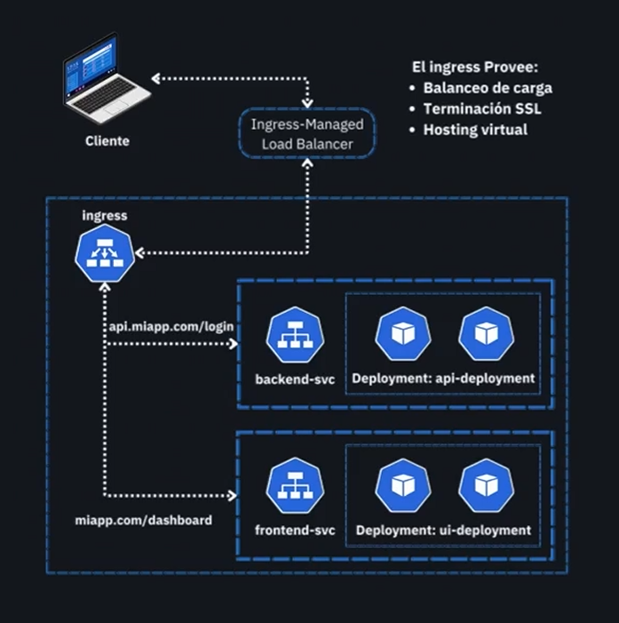

Hay diferentes tipos de ingress managers como:

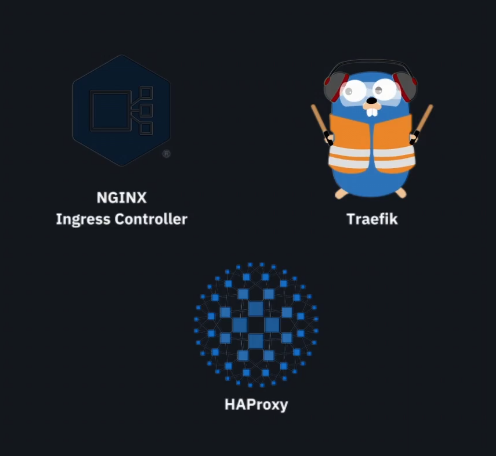


## Habilita el Ingress controller:

```bash
minikube addons enable ingress
```

## Verifica que el NGINX Ingress controller esté funcionando:

```bash
kubectl get pods -n ingress-nginx
```

## Despliega una app "hello, world":

```bash
kubectl create deployment web --image=gcr.io/google-samples/hello-app:1.0
```

```bash
kubectl get deploy
```

## Exposición del Deployment:

```bash
kubectl expose deployment web --type=NodePort --port=8080
```

```bash
kubectl get service
```

```bash
kubectl delete service web
```

## Accede al servicio usando la IP proporcionada:

```bash
minikube service web --url
```

## Crea un Ingress:

```bash
kubectl apply -f https://k8s.io/examples/service/networking/example-ingress.yaml
```

## Verifica que el Ingress esté correctamente configurado:

```bash
kubectl get ingress
```

```bash
kubectl describe ingress example-ingress
```


```bash
minikube tunnel
```

```bash
curl http://hello-world.example
```

# Clase 8 ConfigMaps y Secrets: Configuración y datos sensibles


## Apply ConfigMap
```bash
# Creates or updates the ConfigMap from the auth-config.yaml file
kubectl apply -f auth-config.yaml
```

## Create secret imperatively
```bash
# Creates a Secret named    'auth-secret' with the specified key-value pairs
kubectl create secret generic auth-secret \
  --from-literal=client_id=myclientid \
  --from-literal=client_secret=secret
```

## Apply Secret
```bash
# Creates or updates the Secret from the auth-secret.yaml file
kubectl apply -f auth-secret.yaml
```

## View ConfigMap
```bash
# Lists the ConfigMap named 'auth-config' in the current namespace
kubectl get configmap auth-config
```

## View Secret
```bash
# Lists the Secret named 'auth-secret' in the current namespace
kubectl get secret auth-secret
```

## Other links

- https://external-secrets.io/latest/


# Clase 9 Modelo de red en Kubernetes: Pods y servicios

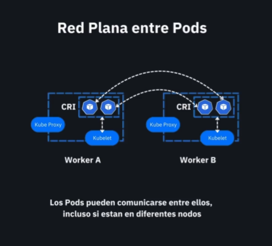

## Resumen
La red de Kubernetes representa uno de los componentes más sofisticados de su arquitectura, permitiendo que pods y servicios se comuniquen de manera fluida sin importar dónde estén alojados físicamente. Esta capacidad de comunicación transparente es fundamental para construir aplicaciones distribuidas robustas y escalables, y entender cómo funciona este modelo de red nos ayuda a resolver problemas y optimizar nuestras implementaciones.

## ¿Cómo funciona el modelo de red en Kubernetes?
El modelo de red de Kubernetes se basa en un concepto aparentemente simple pero técnicamente complejo: la red plana entre pods. Esta característica permite que cada pod pueda comunicarse directamente con cualquier otro pod del clúster, incluso si están en diferentes nodos o workers.

## Este diseño se fundamenta en tres reglas principales:

- **Todos los nodos deben poder conectarse entre sí sin necesidad de Network Address Translation (NAT)**. Esto significa que los workers o nodos están en la misma red y tienen comunicación directa entre ellos.

- **La comunicación debe ser directa entre pods.** Esta transparencia permite que un pod en un namespace (por ejemplo, frontend) pueda comunicarse con otro pod en otro namespace (como backend) utilizando simplemente direcciones IP o nombres de servicios.

- **Pods y servicios comparten el mismo segmento de red.** Esta configuración facilita la comunicación entre servicios y los grupos de pods asociados a deployments u otros objetos de Kubernetes.

## Componentes clave del networking en Kubernetes
La red de Kubernetes funciona gracias a varios componentes que trabajan coordinadamente:

1. Container Network Interface (CNI): Es una interfaz que permite utilizar diferentes plugins para gestionar la red. Entre las opciones más populares destacan:

- Calico: Muy recomendado en la comunidad por su facilidad de aprendizaje y adaptabilidad a múltiples casos de uso.
- Flannel: Ofrece capacidades similares para la configuración de red, aunque presenta algunas limitaciones en aspectos de seguridad.

2. kube-proxy: Este componente, del que ya hemos hablado anteriormente, utiliza IPTables (mecanismo de Linux) para el enrutamiento de peticiones. Cuando alguien intenta acceder a un pod, kube-proxy:

- Recibe la petición
- La redirige a los pods apropiados del servicio
- Actualiza las rutas en IPTables cuando hay cambios

3. CoreDNS: Es el componente responsable del service discovery, permitiendo utilizar nombres de servicios para referenciar grupos específicos de pods o servicios dentro del clúster.

## El modelo OSI y TCP/IP en Kubernetes
Desde una perspectiva técnica, Kubernetes utiliza el modelo práctico TCP/IP (basado en el modelo teórico OSI):

- Los pods se comunican utilizando la capa 3 (red), empleando enrutamiento y protocolo IP.
- Los servicios utilizan protocolos de capas superiores (aplicación y transporte), aprovechando TCP, UDP y mecanismos de balanceo de carga.

## ¿Por qué es importante el modelo de red en Kubernetes?
El sofisticado modelo de red de Kubernetes es lo que permite que nuestras aplicaciones distribuidas funcionen de manera coordinada. Un clúster de Kubernetes puede ejecutarse en diversos entornos:

- En la nube
- En entornos on-premise
- En máquinas virtuales dentro de un mismo host

**En todos estos casos**, la red de Kubernetes garantiza que los componentes puedan comunicarse adecuadamente, manteniendo la disponibilidad, tolerancia a fallos y resiliencia de nuestras aplicaciones.

## Service discovery y su importancia
**CoreDNS** juega un papel fundamental en la arquitectura de Kubernetes, ocupándose del service discovery entre los servicios y grupos de pods asociados. Esto permite que cualquier componente pueda ser alcanzado tanto interna como externamente, sin preocuparse por conocer las direcciones IP exactas de cada elemento.

Aunque estos conceptos pueden parecer altamente teóricos, son fundamentales para realizar un efectivo troubleshooting y comprender el comportamiento de pods y servicios dentro de un clúster de Kubernetes.

El entendimiento de la red en Kubernetes constituye una base sólida para cualquier ingeniero que trabaje con esta tecnología, permitiendo diseñar arquitecturas más robustas y solucionar problemas de conectividad de forma eficiente. ¿Has experimentado alguna situación donde el conocimiento del modelo de red de Kubernetes te haya ayudado a resolver un problema? ¿Conoces cuál es la capacidad máxima por defecto en la capa de red de Kubernetes? Comparte tus experiencias en los comentarios.

## Capacidad Maxima de elementos en la red de Kubernetes

Kubernetes v1.34 admite clústeres de hasta 5000 nodos. En concreto, Kubernetes está diseñado para admitir configuraciones que cumplen todos los siguientes criterios:

No más de 110 pods por nodo
No más de 5.000 nodos
No más de 150.000 pods en total
No más de 300.000 contenedores en total
Source: https://kubernetes.io/docs/setup/best-practices/cluster-large/#:~:text=More%20specifically%2C%20Kubernetes%20is%20designed,more%20than%20150%2C000%20total%20pods

Nota: en cloud las cuotas pueden variar dependiendo del proveedor y region escogido. Se suelen reservar las capacidades de computo para los grandes clientes.

# Clase 10 Tipos de servicios: ClusterIP, NodePort, LoadBalancer y ExternalName

## Resumen
¿Cómo exponer aplicaciones en Kubernetes?
A la hora de trabajar con Kubernetes, uno de los retos más importantes es aprender a exponer nuestras aplicaciones al mundo exterior. Es decir, habilitar la conexión de nuestras aplicaciones desplegadas en un clúster con usuarios externos. En el ecosistema de Kubernetes, existen cuatro componentes principales que se utilizan para esta tarea: NodePort, ClusterIP, LoadBalancer y ExternalName.

## ¿Qué es un NodePort?
El concepto de NodePort es esencial dentro de Kubernetes. Este tipo de servicio nos permite exponer un pod en un puerto específico de cada nodo del clúster. Es notable que en escenarios más avanzados, como en el uso de MiniCube, puedes crear clústeres de múltiples nodos.

Para configurarlo, lo primero que debes hacer es definir este servicio en un archivo YAML. Un ejemplo básico incluye los siguientes elementos:

Metadata para relacionar el servicio con un ReplicaSet, Deployment o Pod.
El containerPort que el deployment utiliza (e.g., 8080).
El nodePort que permite conectar el tráfico externo hacia el pod.
Aquí te muestro cómo se vería un archivo de configuración:

```sh
apiVersion: v1
kind: Service
metadata:
  name: hello-nodeport
spec:
  selector:
    app: HelloNodePort
  type: NodePort
  ports:
    - protocol: TCP
      port: 80
      targetPort: 8080
      nodePort: 30007
```
Para implementar este servicio, utiliza el comando:

kubectl apply -f deployment-nodeport.yaml
¿Para qué sirve un ClusterIP?
El servicio tipo ClusterIP es usado cuando se desea exponer aplicaciones dentro del mismo clúster. Esta funcionalidad es ideal cuando varios microservicios o aplicaciones necesitan comunicarse entre sí dentro del clúster.

La configuración es bastante parecida al NodePort, pero enfocada en la conectividad interna. Aquí, el servicio toma una dirección IP específica del rango CIDR asignado al clúster.

apiVersion: v1
kind: Service
metadata:
  name: hello-cluster-ip
spec:
  selector:
    app: HelloClusterIP
  type: ClusterIP
  ports:
    - protocol: TCP
      port: 80
      targetPort: 8080
Para desplegar este servicio, usa:

kubectl apply -f deployment-clusterip.yaml
¿Cómo se gestiona un LoadBalancer?
Este es el servicio adecuado cuando se trabaja en entornos de nube como AWS, GCP o Azure. Al detectarse un servicio tipo LoadBalancer, el proveedor de la nube automáticamente despliega una instancia que gestionará el tráfico.

Aquí tienes un ejemplo de configuración:

apiVersion: v1
kind: Service
metadata:
  name: hello-loadbalancer
spec:
  selector:
    app: HelloLoadBalancer
  type: LoadBalancer
  ports:
    - protocol: TCP
      port: 80
      targetPort: 8080
El comando para aplicarlo es:

kubectl apply -f deployment-loadbalancer.yaml
## ¿Qué es un ExternalName y cuándo usarlo?

El servicio ExternalName es muy útil para conectar Kubernetes con recursos de terceros, como bases de datos externas. A diferencia de los tipos anteriores, ExternalName no gestiona pods directos, sino que encapsula la URL del recurso externo, facilitando su uso y refactorización en grandes aplicaciones.

```yaml
apiVersion: v1
kind: Service
metadata:
  name: my-database-service
spec:
  type: ExternalName
  externalName: database.example.com
```

## Para crear este recurso simplemente ejecuta:

`kubectl apply -f externalname.yaml`

Estos son los cuatro tipos fundamentales de servicios en Kubernetes para exponer aplicaciones. Cada uno tiene su caso de uso específico y ofrecen una forma distinta de gestionar el tráfico hacia y desde tus aplicaciones. Explora y decide cuál es el mejor para tus necesidades, y no dejes de compartir tu experiencia en los comentarios.

Nos permite conectar nuestro cluster con recursos de terceros

## Los tipos de servicios en Kubernetes tienen diferentes casos de uso en la nube:

**ClusterIP**: Ideal para comunicar servicios internos en un clúster. Por ejemplo, microservicios que se comunican entre sí sin exponer tráfico externo.

**NodePort**: Útil para acceder a un servicio desde fuera del clúster utilizando el puerto de un nodo. Puede ser usado para pruebas rápidas de aplicaciones.

**LoadBalancer**: Se usa en entornos de producción en la nube (como AWS, GCP, Azure) para distribuir tráfico a múltiples instancias de un servicio. Permite que aplicaciones estén disponibles públicamente.

**ExternalName**: Facilita la integración con servicios externos, como bases de datos o APIs, al permitir que se utilice un nombre DNS en lugar de una URL directa, simplificando la configuración.

Cada uno de estos servicios optimiza la comunicación y disponibilidad de aplicaciones en la nube.

# 11 Volúmenes persistentes (PV) y reclamaciones (PVC)


En local bases de datos con kubernets puede ser una buena herramienta de desarrollo, pero en producción no es recomendable correr bases de datos dentro de k8s.

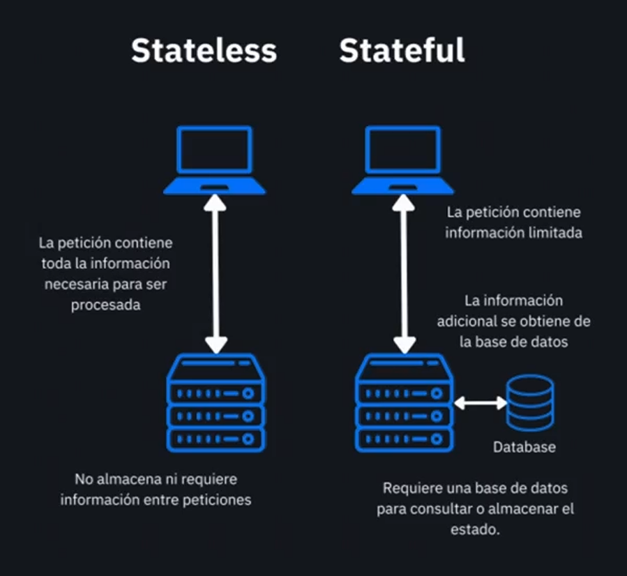

## Resumen

El almacenamiento persistente en Kubernetes es fundamental para preservar datos críticos en escenarios de producción y desarrollo. Cuando trabajamos con aplicaciones que requieren conservar información, es imprescindible implementar volúmenes persistentes correctamente configurados. Los conceptos de PV (Persistent Volume) y PVC (Persistent Volume Claim) son esenciales para garantizar que nuestras aplicaciones mantengan la integridad de los datos incluso cuando los pods se reinician o se eliminan.

## ¿Por qué es crucial implementar almacenamiento persistente en Kubernetes?

Cuando ejecutamos aplicaciones en Kubernetes sin configurar adecuadamente el almacenamiento persistente mediante PV y PVC, nos arriesgamos a perder todos nuestros datos. Esto es especialmente crítico en entornos de producción donde la pérdida de información puede tener consecuencias devastadoras.

Si bien es cierto que en entornos productivos no se recomienda gestionar bases de datos directamente en Kubernetes (prefiriendo servicios gestionados como AWS RDS), en entornos de desarrollo implementar bases de datos dentro del clúster puede generar ahorros significativos. Esto nos evita mantener servicios externos como RDS, RabbitMQ u otros servicios de almacenamiento que generan costos constantes, especialmente cuando no se utilizan continuamente durante el desarrollo.

Diferencias entre aplicaciones stateless y stateful
Antes de profundizar en PV y PVC, es importante entender dos conceptos fundamentales en el diseño de aplicaciones:

**Stateless** (sin estado): Cada petición es independiente y contiene toda la información necesaria para ser procesada. No requiere acceder a datos almacenados previamente para resolver la solicitud. Un ejemplo típico es una API REST donde cada petición incluye en el body todos los datos necesarios para generar una respuesta.

**Stateful** (con estado): Estas aplicaciones requieren acceder a datos persistentes para procesar las solicitudes. Cuando se recibe una petición con información limitada, el backend debe consultar una base de datos u otro sistema de almacenamiento para obtener información adicional y generar una respuesta adecuada.

La principal diferencia entre ambos enfoques radica en la necesidad de acceder a datos persistentes, y es aquí donde los conceptos de PV y PVC cobran vital importancia en el contexto de Kubernetes.

## ¿Cómo funcionan los PV y PVC en Kubernetes?
Podemos entender los PV y PVC a través de una metáfora sencilla: un almacén de datos y una llave para acceder a él.

**Persistent Volume (PV)**: Representa el almacén de datos físico, el volumen donde se encuentra nuestra información.

**Persistent Volume Claim (PVC)**: Actúa como la llave que permite a los pods acceder al almacén de datos. Es una solicitud de almacenamiento que realiza un pod.

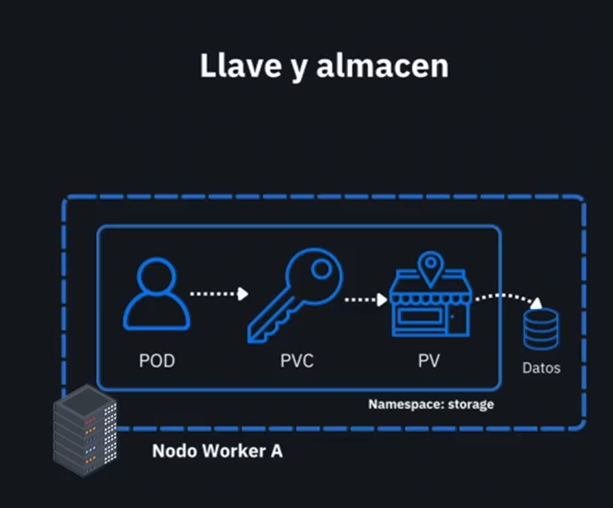

Esta arquitectura ofrece una capa de abstracción que permite a los desarrolladores no preocuparse por los detalles específicos del almacenamiento subyacente, centrándose únicamente en solicitar el espacio que necesitan mediante los PVC.

## Tipos de almacenamiento (Storage Classes)
Kubernetes ofrece diferentes clases de almacenamiento:

**Storage Class Manual**: Utilizada principalmente en entornos locales, haciendo referencia a directorios dentro de la máquina local.

**Servicios de AWS**: Como EFS (Elastic File System) o EBS (Elastic Block Storage), que proporcionan mayor eficiencia, alta disponibilidad y facilitan los respaldos y migraciones de datos.

La relación entre estos componentes sigue un flujo específico: un pod hace referencia a un PVC, y este PVC se vincula a un PV específico, todo definido en los archivos YAML correspondientes.

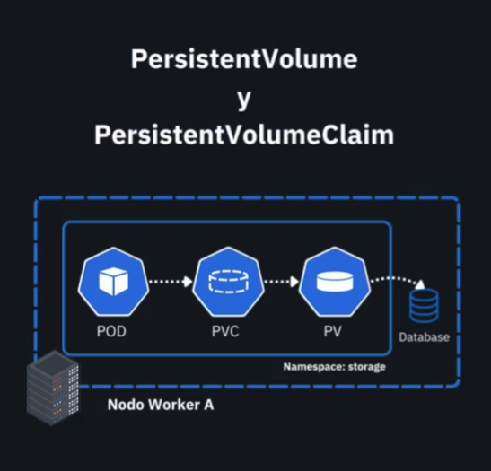

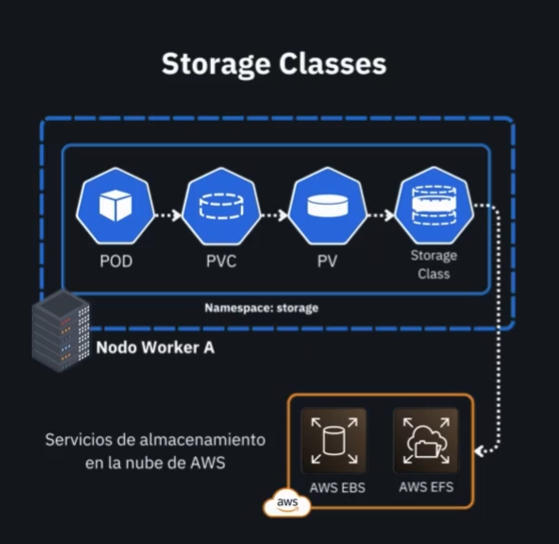

## ¿Cómo implementar PV y PVC en un entorno de desarrollo?
Vamos a recorrer un ejemplo práctico utilizando MiniKube como entorno local:

### Paso 1: Preparar los datos en el host
Primero, necesitamos crear un archivo en el host que será expuesto a nuestro pod:

```sh
sudo su
cd /mnt/data
echo "<h1>Hello from volum</h1>" > index.html
cat index.html
exit
```

### Paso 2: Definir el Persistent Volume (PV)
Creamos un archivo YAML para definir nuestro PV:

```yaml
apiVersion: v1
kind: PersistentVolume
metadata:
  name: myPV
  labels:
    app: nginx-storage
spec:
  capacity:
    storage: 1Gi
  accessModes:
    - ReadWriteOnce
  storageClassName: manual
  hostPath:
    path: /mnt/data
```

En esta definición:

Especificamos una capacidad de 1GB
Configuramos el modo de acceso como ReadWriteOnce (solo un pod puede montarlo)
Definimos la clase de almacenamiento como manual (para entornos locales)
Apuntamos al directorio /mnt/data donde creamos nuestro archivo HTML
Paso 3: Definir el Persistent Volume Claim (PVC)
Ahora creamos el PVC que reclamará el PV anterior:

apiVersion: v1
kind: PersistentVolumeClaim
metadata:
  name: myPVC
spec:
  selector:
    matchLabels:
      app: nginx-storage
  accessModes:
    - ReadWriteOnce
  resources:
    requests:
      storage: 1Gi
  storageClassName: manual
Observa que el PVC utiliza un selector con matchLabels para vincularse específicamente al PV que creamos, coincidiendo con la etiqueta "app: nginx-storage".

Paso 4: Crear un pod que utilice el PVC
Finalmente, definimos un pod que utilice nuestro PVC:

apiVersion: v1
kind: Pod
metadata:
  name: myPod
spec:
  containers:
    - name: nginx
      image: nginx
      volumeMounts:
        - mountPath: "/usr/share/nginx/html"
          name: myvolume
  volumes:
    - name: myvolume
      persistentVolumeClaim:
        claimName: myPVC
Este pod:

Utiliza la imagen de nginx
Monta el volumen en la ruta por defecto donde nginx busca los archivos HTML
Hace referencia al PVC "myPVC" que creamos anteriormente
Paso 5: Aplicar las configuraciones
Aplicamos las configuraciones en orden:

kubectl apply -f pv-pvc.yaml
kubectl apply -f pod.yaml
Paso 6: Verificar la configuración
Comprobamos que tanto el PV como el PVC están correctamente establecidos:

kubectl get pv,pvc
kubectl describe pod myPod
Paso 7: Validar el funcionamiento
Para verificar que todo funciona correctamente:

kubectl exec myPod -- ls -la /usr/share/nginx/html
kubectl port-forward myPod 8080:80
Ahora podemos acceder a localhost:8080 en nuestro navegador y deberíamos ver el mensaje "Hello from volum".

¿Cuáles son los beneficios de utilizar PV y PVC?
La implementación de almacenamiento persistente mediante PV y PVC ofrece múltiples ventajas:

Persistencia de datos: La información sobrevive incluso si los pods se reinician o eliminan.
Abstracción del almacenamiento: Los desarrolladores no necesitan conocer los detalles de la implementación del almacenamiento.
Flexibilidad: Permite cambiar el almacenamiento subyacente sin modificar la aplicación.
Ahorro de costos: Especialmente en entornos de desarrollo, evita tener que mantener servicios externos costosos.
En la era de la inteligencia artificial, la información se ha convertido en oro. Implementar correctamente PV y PVC garantiza que este valioso recurso esté protegido y disponible para tus aplicaciones en Kubernetes, evitando la pérdida de datos críticos para tu organización o tus clientes.

¿Has implementado almacenamiento persistente en tus clústeres de Kubernetes? ¿Qué desafíos has enfrentado? Comparte tu experiencia en los comentarios.

# 12 DaemonSets y StatefulSets

## Resumen
La gestión adecuada de aplicaciones en entornos productivos de Kubernetes requiere el conocimiento de componentes especializados como DaemonSets y StatefulSets. Estos objetos ofrecen soluciones específicas para distintos casos de uso, permitiendo implementar arquitecturas robustas y escalables. Dominando estos conceptos, podrás optimizar el despliegue de aplicaciones que requieran alta disponibilidad o persistencia de datos.

## ¿Qué son los DaemonSets y StatefulSets en Kubernetes?
Los DaemonSets y StatefulSets son objetos de Kubernetes diseñados para casos de uso específicos en entornos productivos. Cada uno tiene características particulares que los hacen adecuados para diferentes situaciones, especialmente cuando se requiere un comportamiento predecible en cuanto a la ejecución y persistencia de los pods.

Ejempo en entornos productivos con bases de datos es donde toman lugar estos objetos

Un DaemonSet garantiza que todos los nodos (o un conjunto específico de nodos) ejecuten una copia de un pod. Cuando se agregan nodos al clúster, se les añade automáticamente un pod del DaemonSet. La característica principal es que cada réplica configurada en un DaemonSet se ejecuta en un nodo a la vez. Esto significa que si configuramos 3 o 4 réplicas, necesitaríamos la misma cantidad de nodos.

Por otro lado, un StatefulSet está diseñado para aplicaciones que requieren persistencia e identificadores estables. A diferencia de los Deployments regulares, los StatefulSets mantienen una identidad persistente para cada pod, lo que resulta útil para aplicaciones con estado como bases de datos.

## ¿Cómo crear un DaemonSet en Kubernetes?
Para crear un DaemonSet, necesitamos definir su especificación en un archivo YAML. La estructura es similar a otros objetos de Kubernetes, con algunas particularidades:

```yaml
apiVersion: apps/v1
kind: DaemonSet
metadata:
  name: nginx-daemonset
spec:
  selector:
    matchLabels:
      app: nginxApp
  template:
    metadata:
      labels:
        app: nginxApp
    spec:
      containers:
      - name: nginx
        image: nginx:latest
        resources:
          requests:
            memory: "64Mi"
            cpu: "250m"
          limits:
            memory: "128Mi"
            cpu: "500m"
```

En este ejemplo, definimos un DaemonSet con un pod que ejecuta Nginx. Es importante definir los recursos que nuestros pods utilizarán, como se muestra en la sección de resources. Esto establece que el pod tendrá asignados inicialmente 64Mi de memoria y 250m de CPU, con límites de 128Mi y 500m respectivamente.

Para crear este DaemonSet, ejecutamos:

kubectl apply -f daemonset.yaml
Y podemos verificar su creación con:

kubectl get ds
¿Cómo implementar StatefulSets con almacenamiento persistente?
Los StatefulSets generalmente se utilizan junto con volúmenes persistentes (PV) y reclamos de volúmenes persistentes (PVC) para mantener el estado de las aplicaciones. Antes de crear un StatefulSet, necesitamos configurar estos recursos de almacenamiento:

Primero, creamos un PV y PVC:
kubectl apply -f pv-pvc.yaml
Luego, creamos el StatefulSet:

```yaml
apiVersion: apps/v1
kind: StatefulSet
metadata:
  name: nginx-sts
spec:
  replicas: 2
  selector:
    matchLabels:
      app: nginx
  template:
    metadata:
      labels:
        app: nginx
    spec:
      containers:
      - name: nginx
        image: nginx:latest
        resources:
          requests:
            memory: "64Mi"
            cpu: "250m"
          limits:
            memory: "128Mi"
            cpu: "500m"
        volumeMounts:
        - name: nginx-data
          mountPath: /var/www/html
  volumeClaimTemplates:
  - metadata:
      name: nginx-data
    spec:
      accessModes: ["ReadWriteOnce"]
      storageClassName: "standard"
      resources:
        requests:
          storage: 1Gi

```

Una característica importante de los StatefulSets es que requieren un servicio "headless" (ClusterIP: None). Este servicio permite que cada pod del StatefulSet tenga una dirección DNS estable, lo que facilita la comunicación entre pods.

Al crear este StatefulSet, notarás que los pods se crean con nombres predecibles:

```txt
nginx-sts-0
nginx-sts-1
```

### ¿Cuáles son los casos de uso y limitaciones de DaemonSets y StatefulSets?

#### Casos de uso para DaemonSets:
- Agentes de monitoreo: como Prometheus, que necesitan ejecutarse en cada nodo
- Recolección de logs: herramientas como Logstash o Fluentd
- Proxies de red: como kube-proxy
- Daemons de almacenamiento: que necesitan ejecutarse en cada nodo


#### Casos de uso para StatefulSets:
- Bases de datos: MySQL, PostgreSQL (para desarrollo, no siempre recomendado para producción)
- Sistemas distribuidos: Kafka, Elasticsearch
- Aplicaciones que requieren identidades persistentes

#### Limitaciones:

Tanto los DaemonSets como los StatefulSets tienen restricciones importantes a considerar:

No permiten rollbacks inmediatos como los Deployments
Solo se pueden escalar o reducir de un pod a la vez
Esto puede afectar la experiencia del usuario dependiendo del dominio de aplicación
Es importante entender estas limitaciones para determinar si estos objetos son adecuados para tu caso de uso específico o si sería mejor utilizar otras alternativas como los Deployments.

El poder de Kubernetes radica en su capacidad para desacoplar componentes y crear pods efímeros cuando sea necesario, proporcionando soluciones específicas para diferentes escenarios de despliegue a través de sus diversos objetos y recursos.

¿Has utilizado DaemonSets o StatefulSets en tus proyectos? ¿Qué otros casos de uso crees que serían adecuados para estos objetos? Comparte tu experiencia en los comentarios.

# Clase 13 Despliegue de una aplicación multi-tier en Local

Resumen
¿Cómo desplegar una aplicación de prueba con Kubernetes'
Desplegar aplicaciones en Kubernetes representa una gran ventaja para desarrolladores en la administración de aplicaciones en la nube. Este proceso de aprendizaje resulta esencial si buscas escalar eficientemente tus servicios. Utilizar herramientas como Docker y Kubernetes es fundamental para conseguir una orquestación efectiva de contenedores en producción. Este es un tema que aborda desde la integración con Docker hasta la adaptación utilizando Kubernitis.

¿Cómo se estructura la aplicación?
La aplicación consta de un backend y un frontend, desarrollados a partir de proyectos del curso avanzado de Docker. Estos componentes se dividen de la siguiente manera:

Backend (Python):


Ruta get a /getmyinfo que expone un JSON


Puerto expuesto: 5001

Dockerfile con una imagen de Python Alpine, instalando Flask, Flask Cors y Waitress.

Frontend (Nginx):

Copia de archivos de sitio hacia /usr/share/nginx/html

Ejecuta un script request.js que hace una petición a localhost:5001.

¿Cómo se usa Docker Compose para desplegar esta aplicación?
Para gestionar esta aplicación, Docker Compose se convierte en un aliado invaluable. Realiza las siguientes acciones:

Construcción de los contenedores:

docker-compose build

Recomendación: algunos sistemas operativos requieran ejecutar docker compose build en vez de docker-compose build.
Ejecución de la aplicación:

docker-compose up

Válida que el frontend (puerto 8080) y el backend (puerto 5001) están funcionando a través de un navegador.
¿Cómo adaptar tu despliegue a Kubernetes?
El paso a Kubernetes requiere de una adaptación cuidadosa de la aplicación existante en Docker. Aquí te mostramos cómo:

Creación de archivos YAML necesarios:
Configurar archivos deployment y service tanto para el backend como para el frontend.
Ejecución de servicios en Kubernetes:
Utiliza MiniCube que es ideal para pruebas locales.
Cambia el tipo de servicio de NodePort a LoadBalancer si se presentan errores de conexión.
Aplicar los cambios:

```sh
kubectl apply -f backend/ kubectl apply -f frontend/
```

¿Qué herramientas adicionales se pueden emplear?
MiniCube:

Tienes la opción de hacer un túnel con minikube service para simular el tráfico desde tu máquina local.

Edición y despliegue de servicios:

Usa comandos directamente en kubectl para revisar servicios y pods: bash kubectl get pods kubectl get services

¿Cuáles son los desafíos adicionales?
Ahora que conoces el despliegue básico, se presenta el reto de conectar una base de datos como PostgreSQL o MySQL. Integra las funciones de backend para que el frontend procese datos desde esta fuente. Ajustar la configuración de manera que optimice las consultas y refleje la información actualizada brinda una aplicación más robusta y completa.

Desarrollar aplicaciones con Kubernetes ofrece no solo conocimiento técnico específico, sino también la habilidad de escalar servicios de manera eficiente. Te alentamos a que sigas explorando y perfeccionando tus habilidades.


# Clase 14 Jobs y CronJobs: Tareas únicas y programadas

Resumen
Los jobs y cronjobs en Kubernetes representan una solución elegante para ejecutar tareas programadas o efímeras dentro de tu infraestructura cloud. Estas herramientas te permiten optimizar recursos, automatizar procesos críticos y gestionar de manera eficiente aquellas aplicaciones que no necesitan estar en ejecución constante, como ocurre con backups, migraciones de datos o limpieza de logs.

¿Qué diferencia a los jobs y cronjobs de otros objetos en Kubernetes?

A diferencia de deployments o statefulsets que mantienen pods en ejecución continua, los jobs y cronjobs están diseñados para tareas que deben ejecutarse una vez o repetidamente en intervalos específicos. El verdadero valor de estos recursos radica en su capacidad para ejecutar procesos completos y luego liberar recursos, algo perfecto para entornos donde la optimización es crucial.

Mientras un job se utiliza para ejecutar una tarea única hasta su finalización, un cronjob permite programar la ejecución repetitiva de jobs según una programación temporal definida mediante sintaxis cron.

# Clase 15