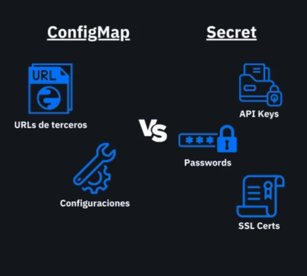
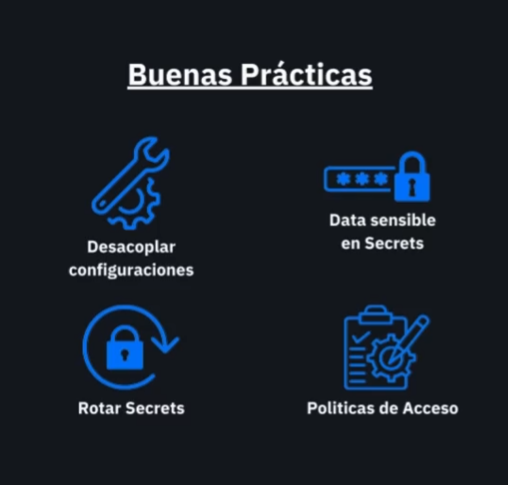

# 08-configs-secrets

## Apply ConfigMap
```bash
# Creates or updates the ConfigMap from the auth-config.yaml file
kubectl apply -f auth-config.yaml
```

## Create secret imperatively
```bash
# Creates a Secret named    'auth-secret' with the specified key-value pairs
kubectl create secret generic auth-secret \
  --from-literal=client_id=myclientid \
  --from-literal=client_secret=secret
```

```sh
kubectl create secret generic auth-secret --from-literal=client_id=myclientid --from-literal=client_secret=secret
```

### Other ways https://kubernetes.io/docs/tasks/configmap-secret/managing-secret-using-kubectl/

### Use source files
Store the credentials in files:

```sh
echo -n 'admin' > ./username.txt
echo -n 'S!B\*d$zDsb=' > ./password.txt
```

The -n flag ensures that the generated files do not have an extra newline character at the end of the text. This is important because when kubectl reads a file and encodes the content into a base64 string, the extra newline character gets encoded too. You do not need to escape special characters in strings that you include in a file.

Pass the file paths in the kubectl command:

```sh
kubectl create secret generic db-user-pass \
    --from-file=./username.txt \
    --from-file=./password.txt
```
The default key name is the file name. You can optionally set the key name using --from-file=[key=]source. For example:

```sh
kubectl create secret generic db-user-pass \
    --from-file=username=./username.txt \
    --from-file=password=./password.txt
```


## Apply Secret

```bash
# Creates or updates the Secret from the auth-secret.yaml file
kubectl apply -f auth-secret.yaml
```

## View ConfigMap
```bash
# Lists the ConfigMap named 'auth-config' in the current namespace
kubectl get configmap auth-config
```

## View Secret
```bash
# Lists the Secret named 'auth-secret' in the current namespace
kubectl get secret auth-secret
```

```sh
kb describe secrets auth-secret
Name:         auth-secret
Namespace:    default
Labels:       <none>
Annotations:  <none>

Type:  Opaque

Data
====
client_id:      10 bytes
client_secret:  6 bytes
```


### Edit Secret

```sh
kb edit secrets auth-secret
```

```sh
apiVersion: v1
data:
  client_id: bXljbGllbnRpZA==
  client_secret: c2VjcmV0
kind: Secret
metadata:
  creationTimestamp: "2026-01-18T19:00:55Z"
  name: auth-secret
  namespace: default
  resourceVersion: "41509"
  uid: e7d69751-030e-4e7d-ba4b-26f024b64388
type: Opaque
```

Los valores del secreto están codificados en base64. como una capa extra de ofuscación.

para decodificar

```sh
echo {valor_en_base64} | base64 --decode
```

## Other links

- https://external-secrets.io/latest/







## Usando configmaps en pods

```yaml
apiVersion: v1
kind: ConfigMap
metadata:
  name: special-config
  namespace: default
data:
  special.how: very
---
apiVersion: v1
kind: ConfigMap
metadata:
  name: env-config
  namespace: default
data:
  log_level: INFO
```

```yaml
apiVersion: v1
kind: Pod
metadata:
  name: dapi-test-pod
spec:
  containers:
    - name: test-container
      image: registry.k8s.io/busybox:1.27.2
      command: [ "/bin/sh", "-c", "env" ]
      env:
        - name: SPECIAL_LEVEL_KEY
          valueFrom:
            configMapKeyRef:
              name: special-config
              key: special.how
        - name: LOG_LEVEL
          valueFrom:
            configMapKeyRef:
              name: env-config
              key: log_level
  restartPolicy: Never
```