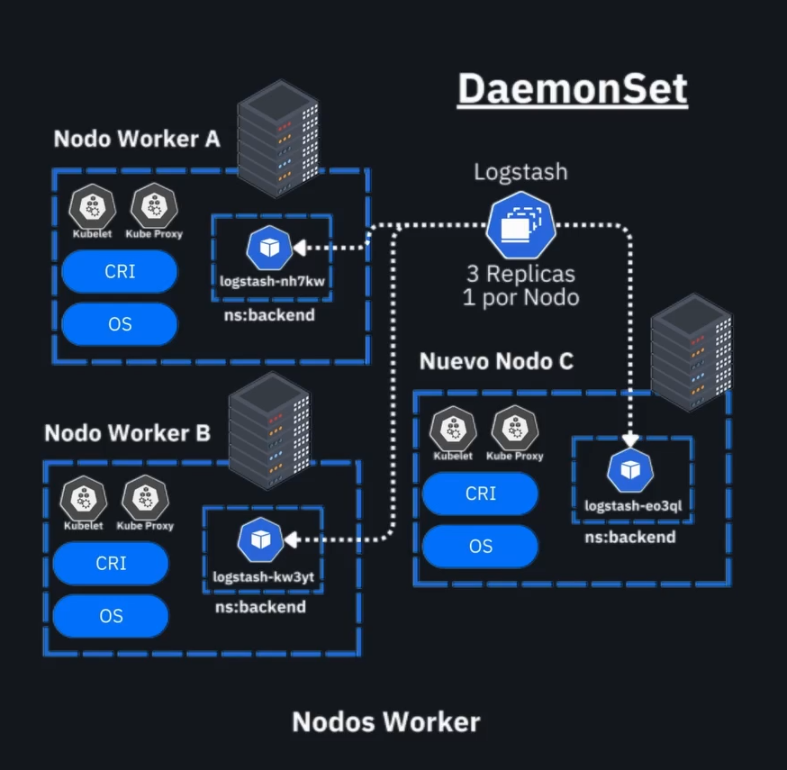
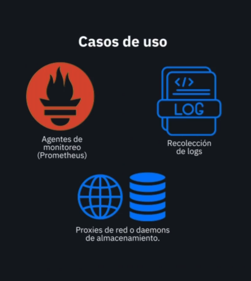
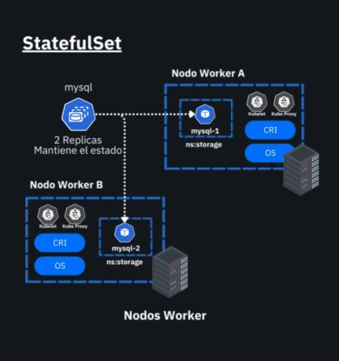
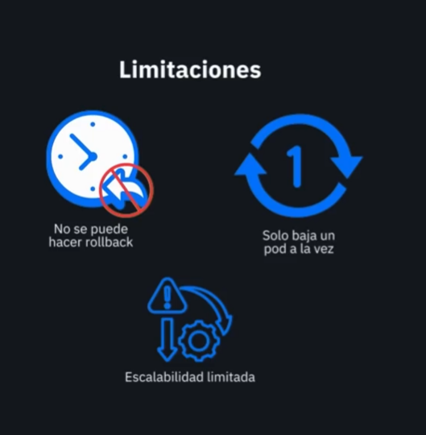

# 12-daemonsets-statefulsets

# Create a DaemonSet

```bash
kubectl apply -f daemonset.yaml
```

Cada replica que tenemos en el daemonset se configura para que se ejecute en un nodo a la vez

# Verify the setup
```bash
kubectl get ds
kubectl get pods -l app=nginx-app
```

# Create a StatefulSet and its PersistentVolume

```bash
# Make sure your PV and PVC exist first
kubectl apply -f pv-pvc.yaml
# Then apply the StatefulSet
kubectl apply -f statefulset.yaml
```

El persisten volume, en el ejemplo es una carpeta pero en produccion puede ser una base de datos SQL por ejemplo


Al borrar la union pv, pvc , hay que eliminar el pvc.

El estatefulset esta diseñado para aplicaciones que requieren el uso de bases de datos.

El statefulset necesita un service

```yaml
apiVersion: v1
kind: Service
metadata:
  name: nginx-service
spec:
  clusterIP: None  # Headless service
```

El daemon set NO es persistente.

# Verify the setup
```bash
kubectl get sts
kubectl get pods -l app=nginx-app
kubectl get pvc my-pvc
```

# Delete the StatefulSet
```bash
kubectl delete sts nginx-sts
```










Con el statefulset y el daemonset no podemos hacer rollback inmediato como hariamos con un deployment.